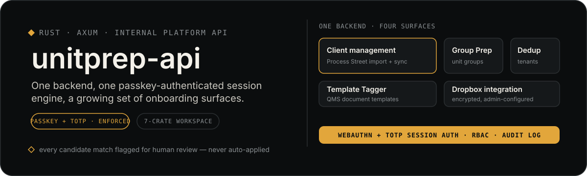

<p align="center">
  
</p>

<p align="center">
  <a href="#running">Quick start</a> ·
  <a href="#how-it-works">How it works</a> ·
  <a href="#project-layout">Project layout</a> ·
  <a href="#current-status">Current status</a>
</p>

UnitPrep is Quikstor's internal platform for preparing self-storage
facility data during QMS onboarding and migration — a growing set of
independent tools sharing one backend, one session model, and one
frontend shell. This repo is that backend: a Rust/Axum HTTP API. The
frontend is [`unitprep-ui`](../unitprep-ui) (Next.js); this project has
no CLI of its own — it's a session-oriented web service.

Two tools ship today:

- **Group Prep** — the original tool this platform was built around
  (internally the code still says `unit-group`/`UnitGroup` throughout;
  the rename is product-facing only so far). Compares UnitGroup names
  discovered in facility unit exports against a master/reference Unit
  Group file, identifies net-new groups, flags advisory (non-authoritative)
  similarity warnings, and generates a downloadable ZIP of
  migration-ready import artifacts.
- **Duplicate tenant check** ("dedup") — flags multi-unit tenants whose
  contact info disagrees across units, and surfaces likely typo/
  name-variant tenants for human review. Exports a CSV report; no
  corrective action happens in the platform itself.

## Why it's built this way

- **Advisory, never authoritative.** Fuzzy matching (name similarity,
  typo/variant detection) only ever *flags* something for a human to
  confirm. Existence and merging decisions are always exact-match or
  human-made — nothing is auto-merged regardless of similarity score.
- **Nothing is silently mutated.** Corrections are applied as
  session-level overlays on top of the original parsed upload, which is
  never touched. A session that isn't found returns a distinct 404, not
  a fake zero-value success — the frontend needs to tell those apart.
- **Interface-first for anything third-party.** New capabilities (auth,
  persistence) land behind a trait with one concrete implementation
  before any handler depends on the concrete type, so the backing
  service can change without a rewrite.

## Running

```bash
cargo run
```

Starts the API on `http://0.0.0.0:8080` (reachable at `127.0.0.1:8080`
locally). Override with the `HOST`/`PORT` env vars if needed — most
hosting platforms (Fly.io, Render, etc.) inject `PORT` automatically.

For anything performance-sensitive, run the optimized build instead —
`cargo run --release` (or build once with `cargo build --release` and
execute `target/release/unitprep` directly). The dev profile is
meaningfully slower for CPU-bound work like Excel parsing; this is a
deploy-time decision, not something toggled at runtime.

CORS defaults to `http://localhost:3000` and `http://localhost:5173`
(the frontend dev servers). Set `CORS_ALLOWED_ORIGINS` (comma-separated)
to allow real deployed frontend origins instead.

```bash
cargo test
```

## How it works

Each browser session is tracked server-side by `session_id` (in-memory,
10-minute idle timeout by default — override with `SESSION_TIMEOUT_SECS`).

### Group Prep — 5 stages

1. `POST /upload` — multipart upload of a folder's files. Creates a
   session and parses every `.csv`, `.xlsx`, and `.xls` file (including
   Excel 2003 SpreadsheetML XML mislabeled with a `.xls` extension),
   returns `session_id`.
2. `POST /discover` — classifies parsed documents into unit files (have
   `UnitGroup`/`Number`/`Category` columns) and master group files (have
   `Name`/`Description`/`AssignedTo`/`Status`/`LastUpdated` columns).
   `POST /group-file/select` picks the authoritative master file when
   discovery finds more than one candidate.
3. `POST /validate` — checks unit files for blank/suspicious `UnitGroup`
   values, malformed dimensions, climate/locality/dimension mismatches,
   duplicate unit numbers, inconsistent casing, and rare/single-unit
   groups. Each issue names the specific affected unit ids. `POST
   /correct` applies one corrected cell as a session-level overlay and
   re-validates; `POST /exempt-dimensions` marks a unit as intentionally
   non-dimensioned so blank Width/Length stops being flagged for it.
4. `POST /analyze` — compares UnitGroup names against the selected
   master file. Existence is decided by **exact name match only**;
   fingerprint + normalized-Levenshtein similarity is advisory-only and
   never affects net-new determination.
5. `POST /export` — requires validation and analysis to have completed
   (or `acknowledge_errors: true` if `Severity::Error` issues remain);
   streams a ZIP built entirely in memory — net-new-groups CSV,
   facility/group assignment CSVs, advisory reports, `batch_run.json`.

### Duplicate tenant check — 3 stages

A separate, independent tool and session type, same `session_id`
tracking. No correction loop — this tool's job is to identify and list
inconsistencies; corrections happen with the client, outside the
platform:

1. `POST /dedup/check` — multipart upload of one QMS End Users export
   CSV. Runs synchronously (no ambiguity to resolve first), returns
   `{session_id, report}` — every multi-unit tenant with a contact-info
   mismatch (grouped by exact `FirtLast` match), and every typo/
   name-variant candidate surfaced for human confirmation.
2. `POST /dedup/report` — re-fetches the same report by `session_id`.
3. `POST /dedup/export` — the report as a downloadable CSV: flagged
   groups first, then a typo/name-variant section.

`GET /health` returns a liveness check.

## Project layout

A Cargo workspace, not a single crate — `unitprep-core` holds the
tool-agnostic engine (file ingestion/parsing, session storage); each
tool's domain logic lives in its own crate (`unit-group/`, `dedup/`);
the binary holds only session/HTTP orchestration. See `Cargo.toml`'s
own comments for the rationale.

- `src/main.rs` — process entry point, logging setup, server bind.
- `src/api/` — Axum handlers and routing, one module per endpoint,
  including both Group Prep's and dedup's (`dedup.rs`, `dedup_view.rs`).
  The largest handlers (`discover`) are split into their own
  submodules rather than one file, following this project's standing
  ~250-line-module review point.
- `src/application/` — session orchestration: `unit_group_session.rs`
  (the stage machine) + `session_service.rs` for Group Prep;
  `dedup_session_service.rs` for dedup. Generic storage mechanics
  (`SessionStore` trait, `InMemorySessionStore`) live in `unitprep-core`.
- `src/infrastructure/` — export artifact generation: `csv_export.rs`
  (Group Prep) and `dedup_csv_export.rs` (dedup).
- `core/` — the `unitprep-core` crate: parsers, source-agnostic
  document models, the generic session engine.
- `unit-group/` — the `unitprep-unit-group` crate: Group Prep's domain
  logic (discovery/validation, batch building, the fingerprint-matching
  engine — itself split into a small module group, not one file). No
  session state, HTTP, or export format.
- `dedup/` — the `unitprep-dedup` crate: dedup's domain logic
  (grouping, contact-info comparison, note composition, typo/
  name-variant detection), same boundary as `unit-group/`.

## Current status

**Auth & persistence — in progress, not yet enforced.** No endpoint is
protected today; this is still an accepted, deliberate internal-only
posture (see below). But the building blocks are landing: self-hosted
WebAuthn/TOTP + Postgres (via Neon, `app_service` role) with row-level
security. Schema and RLS are built and verified on the dev database;
`AuthBackend`/`AuthenticatedUser` and opaque session-cookie plumbing
exist and are exercised end-to-end by `GET /health/whoami` — but no
real endpoint depends on it yet. Rust wiring of the actual
registration/login flows is still ahead.

**No authentication or authorization exists on any live endpoint.** Any
client that can reach this API can create, read, correct, and export
any session if it has (or guesses) the `session_id`. Session ids are
random UUIDs, so this isn't trivially exploitable, but it is not a
security boundary. Accepted for the current internal, single-operator
usage pattern — the trigger to close it (needing real user roles for an
admin panel) has already fired, which is what started the work above.

## Platform vision

"UnitPrep" is deliberately becoming a platform name, not a single
tool's name. None of the following is built yet beyond what's noted
above:

- **Client Prep navigation** — rather than a flat list of tools, the
  frontend's eventual home screen is organized by client/facility: pick
  a client, then run any available tool against it, all optional.
- **QMS vs. QSX** — QSX is Quikstor's legacy, desktop-only PMS, being
  sunset; QMS is the modern cloud/API-capable platform this project is
  building toward. Every tool is file-upload only today. A QMS API
  integration is planned for tools whose source data actually lives in
  QMS — dedup, which migrates tenants *from* QSX, would stay file-only
  regardless.
- **Persistence** — sessions are in-memory only today outside of auth;
  a process restart loses everything. Broader persistence is planned
  once a concrete feature needs it — most likely a "compare this run to
  a past run" capability.

Each of these lands only once a concrete need proves it's worth
building, not speculatively ahead of that.
